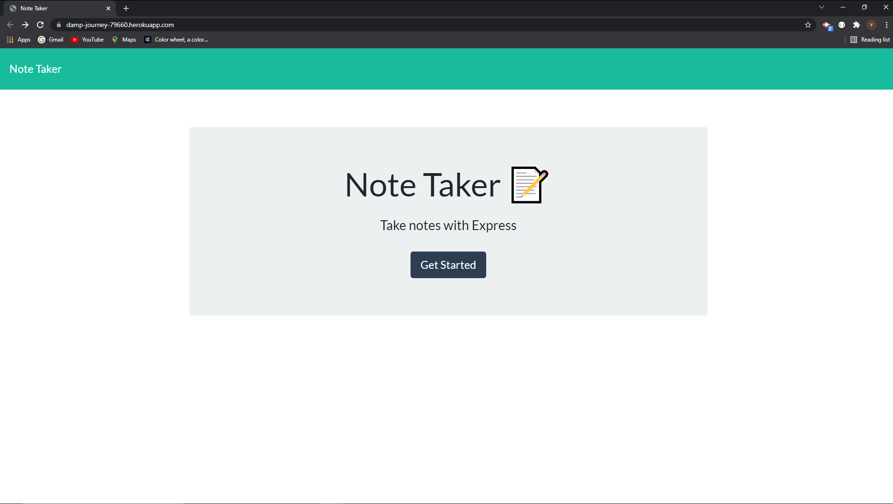
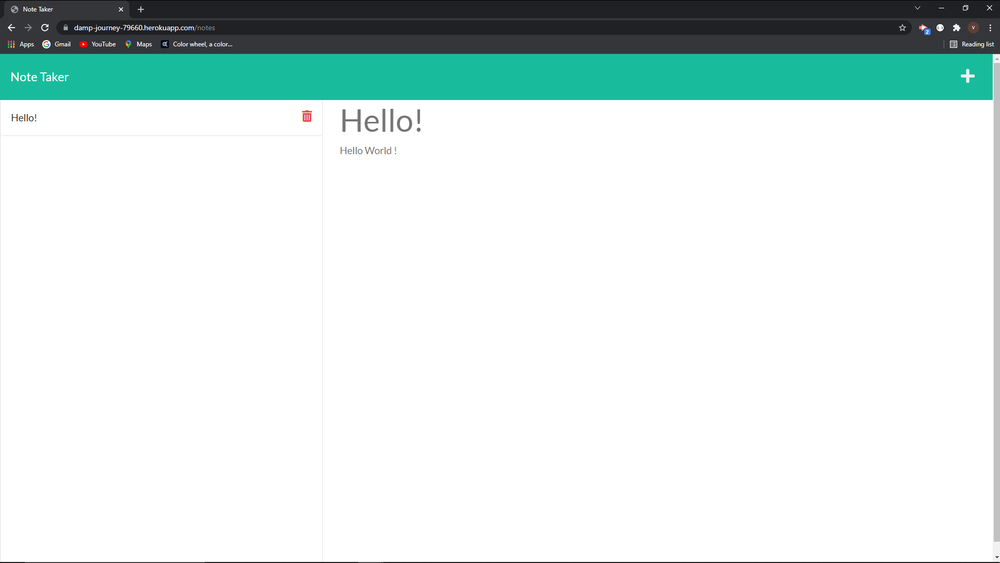

# Note-Taker

## Application Description
- This application allows the user to create, save, and delete notes.
The notes are saved to an array after the user enters text into both the title and text fields and clicks the save icon in the upper right corner.
- When the user clicks the trash can icon next to a saved note the notes array is copied and returned excluding the object that was selected.

[Note-Taker](https://damp-journey-79660.herokuapp.com/)

## Table of Contents
* [Description](#application-description)
* [Installation](#installation)
* [Usage](#usage)
* [License](#license)
* [Contributions](#contributions)
* [Testing](#testing)
* [Questions](#questions)
* [Screenshot](#screenshot)

## Installation
- Installation is not necessary if using the deployed version.
- Use npm install if cloning the repository.

## Usage
Please use it.

## License
N/A

## Contributions
You can contribute by creating a new issue.

## Testing
N/A

## Questions
Please feel free to reach out with any questions or concerns. I can be reached at victorj500@gmail.com or on GitHub at github.com/vic-smith.

## Screenshot

